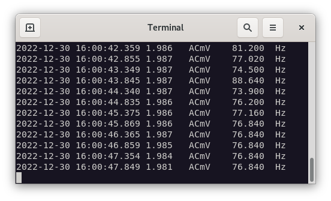
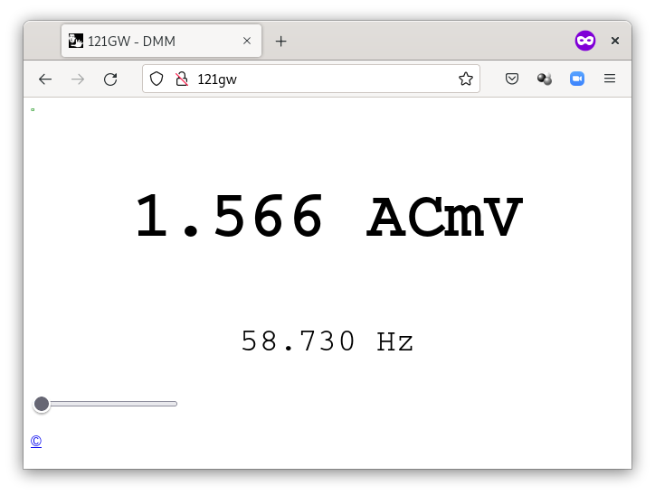
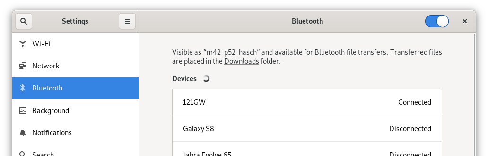

# 121gwcli

121GW multimeter command line data logger for Linux.

The script receives Bluetooth data from a 121GW
digital multimeter and display them on a Linux system.

The script takes the output from the standard Bluetooth
tool `gatttool` and parse it with a Perl script.

Data can be written to:

* Text console
* Tabulator separated Logfile
* Json file for browser display

Tested on Debian 11 bullseye.

## Installation

This system require some packages installed to fully operate:

* bluez (gatttool)
* bluez-tools (bt-device)
* perl
* libswitch-perl

```
sudo apt install perl libswitch-perl bluez{,-tools}
```

## Text mode output to console

Turn on your 121GW multimeter and press `1ms PEAK` for
about one second to activate Bluetooth.

Start the main script `121gwcli.sh`. It takes about 3-4 seconds to connect:

```
./121gwcli.sh
```

Example output:

```
2022-12-30 15:01:44.316	1.642	ACmV	62.97	Hz
2022-12-30 15:01:44.811	1.64	ACmV	62.97	Hz
2022-12-30 15:01:45.306	1.638	ACmV	62.97	Hz
```



Columns:

1. Date and time in ISO-8601 standard w/milli seconds
2. Main value (as from the mittle of the display)
3. Type af main meassuring
4. Sub value (as from upper right corner)
5. Type of sub meassuring

## Options

<dl>
<dt>-o &lt;file&gt;<br>
--outfile=&lt;file&gt;</dt>
<dd>Write data to a file. By default the file will be appended.
The output is tabulator formatted as on screen.</dd>

<dt>-j &lt;file&gt;<br>
--jsonfile=&lt;file&gt;</dt>
<dd>Write data in JSON format to a file.
This can be used to view the current status in a web browser.
See the example of how to setup a web server.</dd>
</dl>

## Write to logfile

Write data to a tabulator separated logfile with option `outfile`:

```
./121gwcli.sh --outfile=o.log
```

## Write JSON data and display in a browser

The data can be written in a JSON formatted file
and then be viewed with a HTML file and a javascript.

Firefox showing the status data from 121GW:




The files used in this setup:

| File            | Purpose                         |
| --------------- | ------------------------------- |
| 121gwcli.sh     | Main script                     |
| parse121gw.pl   | Perl parser                     |
| html/index.html | HTML and Javascript             |
| html/data.js    | JSON-data from 121GW multimeter |

Due to CORS-errors no browseres would allow you to just
open the `index.html` file from the disk and view the
incoming data.
A web server is needed and Nginx is used in this example.

Install Nginx:

```
sudo apt install nginx
```

Create the file `/etc/nginx/sites-available/121gw.conf`

```
server {
    listen 80;
    server_name 121gw;
    root /home/joe/121gwcli/html; # set your path here
    access_log /var/log/nginx/121gw/access.log combined;
    error_log /var/log/nginx/121gw/error.log;
    index index.html;

    location / {
    }
}
```

Create a symlink to the config file:

```
sudo ln -s /etc/nginx/sites-available/121gw.conf /etc/nginx/sites-enabled/121gw.conf
```

Reload Nginx:

```
sudo nginx -s reload
```

Add the hostname (server_name in Nginx) `121gw` bound to `localhost` to line 1 in your `/etc/hosts` file:

```
sudo sed -i '1i127.0.0.1 121gw' /etc/hosts
```

Now you can start your browser and go to <http://121gw/> .

Now turn on the multimeter and start writing to the JSON file:

```
./121gwcli.sh --jsonfile=html/data.js
```

The updated values will now be shown in the browser.

In another terminal console the JSON data can be verified:

```
tr , \\n < html/data.js
```

Example output:

```
{"mainValueFloat":1.638
"subValueFloat":62.97
"Mode_mainMode":"ACmV"
"Mode_subMode":"Hz"
"mainMode":4
"mainRange":0
"mainValue":1638
"subMode":6
"subRange":18
"subValue":6297
"barStatus":1
"barValue":0
"iconStatus":"0x0e2800"}
```

### RAM disk

If you are planning to run the JSON file for a very
long time, the disk might be damaged by writing 
the spot on the disk. A RAM disk can be useful.

In the directory where the `index.html` is located,
create a subdirectory called `tmpfs` and then let
the `data.js` JSON file be placed in there.
Then change `index.html` to read from that directory.

Create a RAM disk with this command:

```
cd html
mkdir tmpfs
sudo mount -t tmpfs -o size=10K tmpfs ./tmpfs
```

## Trouble shooting

It can happend that `gatttool` does connect the first time
and you get a `timeout` error message. Try again.

Example:

```
connect to 88:6B:0F:81:E1:2F: Connection timed out (110)
```

Check the 121GW device is found:

```
bt-device --list | grep 121GW
```

Example output:

```
121GW (88:6B:0F:81:E1:2F)
```

If the device is not seen try go the Linux settings and
enable `121GW` in the Bluetooth configuration.

The `Settings` for Bluetooth seen in Debian when the datalogger is running:



When the datalogger is not running it shows `121GW Disconnected`.

## Further reading

Most of technical information about Bluetooth communication with 121GW comes from these projects:

* <https://gitlab.com/eevblog/app-121gw>
* <https://github.com/zonque/121gw-qt5>

## Known bugs

* If you turn off/on the multimeter during a logging, `gatttool` will not resume the connection.

## TODO

Write a C program which does it all so a lot of scripts is not needed.

